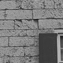

# Supplementary Material for EUSIPCO 2025
Supplementary Material for EUSIPCO 2025
**Impact of a Sharpness Based Loss Function for Removing Out-of-Focus Blur** <br />
Authors: <samp>{aurangau, ramsookd, anil.kokaram}@tcd.ie</samp>

## Abstract
Recent research has explored complex loss functions for deblurring. In this work, we explore the impact of a previously introduced loss function – $Q$ which explicitly addresses sharpness and employ it to fine-tune State-of-the-Art (SOTA) deblurring models. Standard image quality metrics such as PSNR or SSIM do not distinguish sharpness from ringing. Therefore, we propose a novel full-reference image quality metric $\Omega$ that combines PSNR
with $Q$. This metric is sensitive to ringing artifacts, but not to a slight increase in sharpness, thus making it a fair metric for comparing restorations from deblurring mechanisms. Our approach shows an increase of 15% in sharpness ($Q$) and up to 10% in $\Omega$ over the use of standard losses.

## Network Architectures

### XY-Deblur

| --- |
| Figure 1: Architecture of XY-Deblur |

The image above has been taken from the paper - [1](https://openaccess.thecvf.com/content/CVPR2022/papers/Ji_XYDeblur_Divide_and_Conquer_for_Single_Image_Deblurring_CVPR_2022_paper.pdf) <br>
XY-Deblur introduced by Ji et. al. [1] is a single encoder multiple decoder architecture initially intended for restoring images degraded by motion blur. The model leverages the fact that employing multiple decoders allows for decomposing features into directional components, namely horizontal and vertical. The use of shared kernels amongst the decoders allows for improved deblurring performance. These caveats keep the total number of trainable parameters identical to a standard U-Net, viz. 4.2 million, while producing significantly sharper restorations. 


| --- |
| Figure 2: Architecture of EHNet |

The image above has been taken from the paper - [2](https://www.mdpi.com/1424-8220/24/20/6545) <br>
EHNet proposed by Ho et. al. [2] is a transformer based architecture that combines Convolutional Neural Networks (CNNs) and transformers to create a hybrid deblurring mechanism. The CNNs allow for efficient local feature extraction, whereas the transformer decoder with dual-attention enable the model to capture spatial and channel-wise dependencies. The model consists of approximately 8.7 million trainable parameters.


| --- |
| Figure 3: Architecture of ARKNet |

The image from has been taken from the paper - [3](https://ieeexplore.ieee.org/abstract/document/10743912) <br>
ARKNet proposed by Aurangabadkar et. al. [3] is a standard U-Net based architecture comprising of 4 encoder layers, where each layer consists of 5 convolutional blocks. Each block, in turn, comprises of a single 3 × 3 convolution layer, followed by Batch Normalization and GELU activation. The model contains a total of 4.2 million trainable parameters.

## Loss Functions
We first define a restored image as $\tilde{I}$ and a Ground Truth (GT) image as $I$. Let us now list the losses that were used by the authors to train their models initially. These losses are denoted by $\cal L_\varphi$. To use the proposed loss $Q$ [3] in the training routine, we use a composite loss that is defined as follows:
```math
\mathcal{L} = \mathcal{L}_\varphi (I, \tilde{I}) - \beta \cdot Q(\tilde{I})
```
Table 1 shows the model and the associated loss $\mathcal{L}_\varphi$ used in training. <br>
**Table 1: Models and their losses**
| Model Name | $\mathcal{L}_\varphi$ |
| ---------- | -------------------- |
| XY- Deblur |    $\mathcal{l_1}$   |
| ARKNet     |    $\mathcal{l_1}$   |
| EHNet      | $\mathcal{l_1}$ + $\lambda$ $\cdot$ $\mathcal{L}_f$ |

Here $\mathcal{L}_f$ is the frequency loss. <br>
To use $Q$ as part of the training regimes for the methods listed above, we empirically set $\beta$ to 0.1 for ARKNet, 0.01 for XY-Deblur and 0.1 for EHNet. 

## Metric $\Omega$
We wish to devise a metric which increases with sharpness, but decreases with ringing artifacts present in an image. We must note that PSNR works correctly, albeit it lacks the information and knowledge about sharpness, thus leading to a low value even for images that are sharp and have no artifacts. $Q$ is reliable when the PSNR is high, but becomes unreliable when the PSNR is low. An example of this can be seen in Figure 4. 

| --- |
| Figure 4: Behaviour of $\Omega$ | 

Therefore, our goal is to combine the both in a non-linear fashion, thus proposing $\Omega$ which is calculated per patch and is then averaged for the entire image. The intuition behind such a metric is based on the idea of giving more weight to PSNR for a patch that has high ringing and $Q$ when a patch has low ringing. The weighting function used is a sigmoid given as follows.
```math
\sigma(\alpha)  = \frac{1}{1 + e^{R(\alpha - \alpha_0)}}
```

For the experiments listed in the paper, for the experiments listed in the paper, we use $R$ = 5 and $\alpha_0$ = 1.2. These parameters control the amount of _acceptable sharpness_. Therefore, an increase in sharpness leads to an increase in $\Omega$ and when ringing artifacts set in, $\Omega$ decreases. 

### Measuring $\Omega$
To measure $\Omega$, we first divide the images - GT ($I$) and restored (\tilde{I}) into non-overlapping patches of size $m \times m$. A patch from the GT image is denoted by $p$ and a patch from the restored image is denoted by $\tilde{p}$. For each patch from both the images, we measure the corresponding $Q$ values, which we denote by $Q$ for the GT patch and $\tilde{Q}$ for the restored patch. To determine the _amount_ of ringing, we measure a deviation ratio $\alpha$ which can be given as follows.
```math
\alpha = \frac{|\tilde{Q} - Q|}{Q}
```
A higher value of $\alpha$ corresponds to the presence of ringing in the restored patch. We then measure PSNR between the two patches, clipping it at 50 dB as to avoid producing a value of $\infty$ when both patches are identical. This can be mathematically defined as follows.
```math
P' = \min{(PSNR(p, \tilde{p}), 50)}
```
Finally, we combine the two metrics using the weighting function as follows.
```math
\Omega = (1 - \sigma(\alpha)) \cdot P' + \sigma(\alpha) \cdot \tilde{Q}
```
An example of the behaviour of this metric can be seen in Figure 5. Here, an image from the Kodak dataset has been sharpened with 5 different sharpness values - 0.8, 1.3, 1.8, 2.5, 11.8 and 13.8. The numbers have been chosen to demonstrate the difference between _acceptable_ sharpness and ringing artifacts. 

 |  |  |
| --- | --- | --- |
| GT Image; PSNR = -; $\Omega$ = -; $Q$ = 0.08 | $\gamma$ = 0.8; PSNR = 26.54; $\Omega$ = 1.59; $Q$ = 0.13 | $\gamma$ = 1.3; PSNR = 22.55; $\Omega$ = 5.85; $Q$ = 0.15 |

 |  |  |
| --- | --- | --- |
| $\gamma$ = 2.5; PSNR = 20.02; $\Omega$ = 11.09; $Q$ = 0.17 | $\gamma$ = 11.8; PSNR = 10.48; $\Omega$ = 10.98; $Q$ = 0.17 | $\gamma$ = 13.8; PSNR = 10.08; $\Omega$ = 10.50; $Q$ = 0.36 | 

## Experimental Results


## References
[1] Seo-Won Ji, Jeongmin Lee, Seung-Wook Kim, Jun-Pyo Hong, Seung-Jin Baek, Seung-Won Jung, and Sung-Jea Ko, “Xydeblur: divide and conquer for single image deblurring,” in Proceedings of the IEEE/CVF conference on computer vision and pattern recognition, 2022, pp.17421–17430
[2] Quoc-Thien Ho, Minh-Thien Duong, Seongsoo Lee, and Min-Cheol Hong, “Ehnet: Efficient hybrid network with dual attention for image deblurring,” Sensors, vol. 24, no. 20, pp. 6545, 2024.
[3] Uditangshu Aurangabadkar, Darren Ramsook, and Anil Kokaram, “A sharpness based loss function for removing out-of-focus blur,” in 2024 IEEE 26th International Workshop on Multimedia Signal Processing (MMSP), 2024, pp. 1–6.
